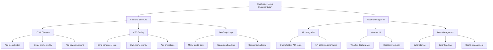

# Hamburger Menu Implementation Plan

## Overview

This document outlines the plan for implementing a hamburger menu with multiple features including weather integration.



## Security Note

⚠️ **Important**: The OpenWeather API key must be handled securely:
- Never commit API keys to version control
- Use environment variables for API key storage
- Implement server-side proxy for API calls if possible
- Add API key to .gitignore if using version control

## Implementation Details

1. **Frontend Structure**
   - **Hamburger Menu Button**
     - Add a hamburger icon button in the top-right corner
     - Use CSS to create three lines for the icon
     - Implement smooth animation for icon transformation
   
   - **Menu Overlay**
     - Create a full-height overlay that slides in from the right
     - Semi-transparent dark background
     - Smooth transition animations
     - Close on outside click

   - **Navigation Items**
     1. "London Helper" - Links to current page
     2. "Weather" - Links to new weather page
     3. Placeholder for future items

2. **Weather Integration**
   - **API Setup**
     - Use OpenWeatherMap free tier API
     - Implement secure API key management using environment variables
     - Set up error handling and rate limit management

   - **Weather Display**
     - Create a new page for weather information
     - Simple view showing:
       * Current temperature
       * Weather conditions
       * Weather icon
       * 12-hour forecast
       * 7-day forecast overview

   - **Data Management**
     - Implemented dual-layer caching strategy:
       * Server-side in-memory cache using Map (30-minute duration)
       * Client-side local storage cache (30-minute duration)
     - Cache management features:
       * Unique cache keys based on endpoint and coordinates
       * Automatic cache invalidation after expiration
       * Hourly cleanup of expired server cache entries
       * Cache hit/miss logging for monitoring
     - Error handling and reliability:
       * Graceful fallback to cached data when available
       * Clear error messages for API failures
       * Consistent cache duration across client and server

## Technical Specifications

1. **HTML Structure**
```html
<button class="hamburger-menu">
  <span></span>
  <span></span>
  <span></span>
</button>

<nav class="menu-overlay">
  <ul>
    <li><a href="index.html">London Helper</a></li>
    <li><a href="weather.html">Weather</a></li>
    <!-- Future items here -->
  </ul>
</nav>
```

2. **CSS Approach**
   - Use CSS variables for consistent styling
   - Implement responsive breakpoints
   - Use transform and transition for smooth animations
   - Match existing dark theme

3. **JavaScript Implementation**
   - Event listeners for menu interactions
   - Weather API integration with secure key handling
   - Data caching and management
   - Error handling

4. **Weather API Integration**
   - Endpoints:
     * Current weather: `/data/2.5/weather`
     * Forecast: `/data/2.5/forecast`
   - Cache weather data for 30 minutes
   - Implement retry mechanism for failed API calls
   - Secure API key handling through environment configuration

## Project Files Structure
```
/
├── index.html (existing)
├── weather.html (new)
├── css/
│   ├── style.css (existing styles)
│   └── menu.css (new menu styles)
└── js/
    ├── menu.js (new)
    └── weather.js (new)
```

## Environment Variables Setup
```env
# Example .env file structure (DO NOT COMMIT THIS FILE)
OPENWEATHER_API_KEY=your_api_key_here
```

## Next Steps

1. Create necessary files and directory structure
2. Implement hamburger menu UI components
3. Set up weather page with API integration
4. Test functionality and responsiveness
5. Implement error handling and offline support

## Implementation Order

1. Frontend Structure
2. Menu Styling and Animations
3. Weather API Integration
4. Weather UI Implementation
5. Testing and Refinements